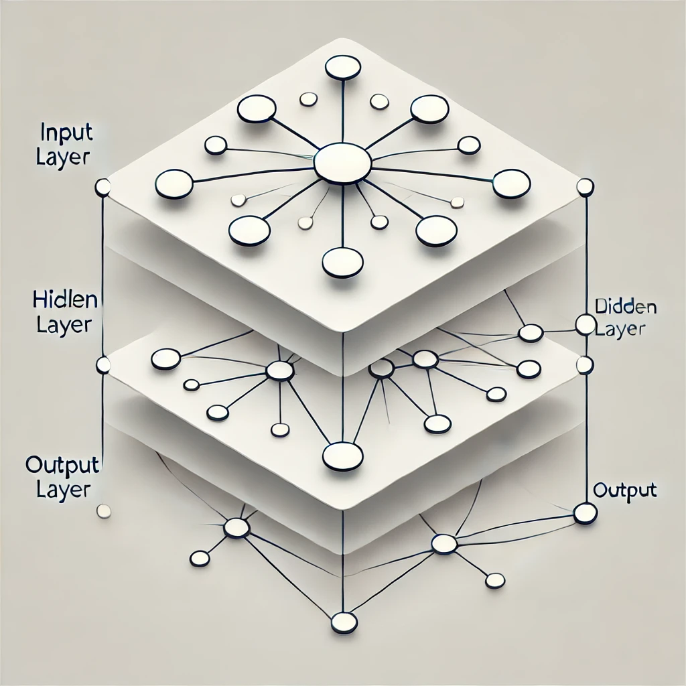

# 🧠 Redes Neuronales Artificiales.
[](https://awesome.re)

## 📚 Introducción
Las redes neuronales artificiales (RNA) representan uno de los avances más fascinantes en el campo de la Inteligencia Artificial (IA) 🚀. Inspiradas en el funcionamiento del cerebro humano, estas estructuras computacionales han revolucionado nuestra capacidad para procesar información y resolver problemas complejos.

El paradigma conexionista, en el que se basan las redes neuronales, propone que la inteligencia emerge de la interconexión de unidades simples de procesamiento, similar a cómo las neuronas biológicas se conectan en nuestro cerebro. Esta perspectiva contrasta con el enfoque simbólico tradicional de la IA, ofreciendo una alternativa más flexible y adaptable.

En las últimas décadas, las redes neuronales han demostrado un potencial extraordinario en diversas aplicaciones, desde el reconocimiento de patrones y el procesamiento del lenguaje natural hasta la toma de decisiones autónomas y la predicción de tendencias. Su capacidad para aprender de los datos y mejorar su rendimiento con el tiempo las ha convertido en una herramienta indispensable en campos tan diversos como la medicina 🏥, las finanzas 💹, la robótica 🤖 y el análisis de big data 📊.

A medida que avanzamos hacia una era cada vez más digitalizada, las redes neuronales continúan expandiendo los límites de lo posible en IA. Su habilidad para manejar problemas no lineales y su robustez frente al ruido en los datos las hacen ideales para enfrentar los desafíos del mundo real. Además, con el aumento de la potencia computacional y la disponibilidad de grandes conjuntos de datos, estamos presenciando un renacimiento de este campo, con arquitecturas cada vez más sofisticadas como las redes profundas y las redes recurrentes.


## 🔍 Definición
Las redes neuronales artificiales son modelos computacionales inspirados en el sistema nervioso biológico, compuestos por unidades de procesamiento interconectadas (neuronas artificiales) que trabajan en conjunto para resolver problemas específicos a través del aprendizaje y la adaptación, la siguinte imagen nos muestra un modelo básico de RNA.




# 🧠 Tipos de Redes Neuronales y Sus Aplicaciones

## 🔄 Redes Feedforward (Prealimentadas)

Las redes feedforward, también conocidas como perceptrones multicapa, son la arquitectura más básica y ampliamente utilizada. En estas redes, la información fluye en una sola dirección, desde la capa de entrada, a través de una o más capas ocultas, hasta la capa de salida. No hay ciclos ni conexiones entre neuronas de la misma capa.

Estas redes son excelentes para tareas de clasificación y regresión. Son capaces de aprender patrones complejos en los datos, lo que las hace versátiles para una amplia gama de aplicaciones.

**Ejemplos de uso cotidiano:**
- 📧 Filtros de spam en correo electrónico
- 💳 Detección de fraudes en transacciones con tarjetas de crédito
- 🏥 Diagnóstico médico basado en síntomas o resultados de pruebas

## 🔁 Redes Recurrentes (RNN)

Las redes neuronales recurrentes se distinguen por sus conexiones cíclicas, que les permiten mantener una especie de "memoria" de entradas anteriores. Esta característica las hace ideales para procesar secuencias de datos donde el contexto temporal es importante.

Las RNN son particularmente efectivas en tareas que involucran series temporales o datos secuenciales, como texto, audio o video.

**Ejemplos de uso cotidiano:**
- 🗣️ Asistentes virtuales como Siri o Alexa
- 📝 Sistemas de traducción automática
- 📈 Predicción de precios de acciones

## 🖼️ Redes Convolucionales (CNN)

Las redes neuronales convolucionales están diseñadas específicamente para procesar datos con una topología similar a una cuadrícula, como imágenes. Utilizan capas de convolución que aplican filtros para detectar características locales en los datos de entrada.

Las CNN son excepcionalmente eficaces en tareas de visión por computadora y procesamiento de imágenes, superando a los humanos en algunas tareas de reconocimiento visual.

**Ejemplos de uso cotidiano:**
- 📷 Reconocimiento facial en smartphones
- 🚗 Sistemas de conducción autónoma
- 👤 Filtros de redes sociales (como los de Snapchat o Instagram)

## 🏗️ Redes Profundas (Deep Learning)

Las redes profundas son redes neuronales con múltiples capas ocultas, lo que les permite aprender representaciones jerárquicas de los datos. Esta profundidad les permite capturar características de alto nivel y abstracciones complejas.

El aprendizaje profundo ha revolucionado muchos campos de la IA, permitiendo avances significativos en problemas que antes se consideraban intratables.

**Ejemplos de uso cotidiano:**
- 🎵 Sistemas de recomendación de música (como Spotify)
- 🎨 Generación de arte con IA (como DALL-E)
- 🏥 Análisis avanzado de imágenes médicas

## 🎭 Redes Generativas Adversarias (GAN)

Las GAN consisten en dos redes que compiten entre sí: un generador que crea datos sintéticos y un discriminador que intenta distinguir entre datos reales y generados. Esta competencia lleva a la creación de datos muy realistas.

Las GAN han abierto nuevas posibilidades en la generación de contenido y han encontrado aplicaciones en arte, diseño y más allá.

**Ejemplos de uso cotidiano:**
- 🖼️ Creación de rostros de personas que no existen
- 🎨 Restauración y colorización de fotos antiguas
- 🎮 Generación de texturas y elementos en videojuegos

## 🧩 Redes de Hopfield

Las redes de Hopfield son un tipo especial de red recurrente diseñada para funcionar como memoria asociativa. Pueden recuperar patrones completos a partir de entradas parciales o ruidosas.

**Ejemplos de uso:**
- 📚 Sistemas de recomendación de libros
- 🧠 Modelado de memoria en estudios cognitivos
- 🔐 Recuperación de contraseñas parcialmente recordadas

## 🌐 Mapas Auto-organizados (SOM)

Los mapas auto-organizados son un tipo de red neuronal que utiliza aprendizaje no supervisado para producir una representación discretizada de baja dimensión del espacio de entrada, llamada mapa.

**Ejemplos de uso:**
- 📊 Visualización de datos financieros complejos
- 🗺️ Análisis de patrones en datos geográficos
- 🛒 Segmentación de clientes en marketing.

---

# 🧠 Ejemplo de una CNN.
## 📚 Introducción

En este ejemplo, implementaremos una red neuronal convolucional (CNN) para el reconocimiento facial utilizando Python y Google Colab. Este proyecto es ideal para estudiantes que desean adentrarse en el mundo del aprendizaje profundo y la visión por computadora.

Las CNN son una clase de red neuronal diseñada para procesar datos utilizando un sistema que imita al ojo humano1. Son particularmente efectivas en el reconocimiento de imágenes, incluyendo el reconocimiento facial, debido a su capacidad para aprender y detectar características jerárquicas en los datos visuales12.

Para este proyecto, utilizaremos TensorFlow y Keras, dos poderosas herramientas para el desarrollo de modelos de aprendizaje profundo. TensorFlow es una biblioteca de código abierto desarrollada por Google para computación numérica y aprendizaje automático a gran escala. Keras, por su parte, es una API de alto nivel que se ejecuta sobre TensorFlow, proporcionando una interfaz más intuitiva y fácil de usar para la construcción de redes neuronales.

TensorFlow ofrece flexibilidad y control sobre la construcción de modelos, permitiendo la creación de arquitecturas complejas y personalizadas. Keras, integrado en TensorFlow, simplifica el proceso de construcción de redes neuronales al proporcionar bloques de construcción predefinidos y fáciles de usar, como capas, optimizadores y funciones de activación.

En nuestro proyecto, aprovecharemos las capacidades de TensorFlow y Keras para construir una CNN capaz de aprender patrones faciales complejos. La red aprenderá a identificar características faciales clave, como la forma de los ojos, la nariz y la boca, y utilizará esta información para reconocer y clasificar rostros con alta precisión3.

Google Colab nos proporcionará un entorno de desarrollo basado en la nube con acceso a GPUs, lo que acelerará significativamente el proceso de entrenamiento de nuestro modelo. Esto permitirá a los estudiantes experimentar con redes neuronales profundas sin necesidad de hardware especializado6.

## 🛠️ Configuración del Entorno

1. Abre Google Colab y crea un nuevo cuaderno[2].
2. Asegúrate de tener una GPU activada para acelerar el entrenamiento[2].

```python
# Verifica la GPU
!nvidia-smi
```

## 📦 Instalación de Dependencias

```python
!pip install tensorflow opencv-python numpy matplotlib
```

## 💾 Preparación de Datos

1. Crea un conjunto de datos de rostros o utiliza uno existente.
2. Organiza las imágenes en carpetas por persona.

```python
from google.colab import drive
drive.mount('/content/drive')

# Asume que tus datos están en Google Drive
!cp -r /content/drive/MyDrive/facial_dataset /content/
```

## 🏗️ Construcción del Modelo CNN

```python
import tensorflow as tf
from tensorflow.keras import layers, models

model = models.Sequential([
    layers.Conv2D(32, (3, 3), activation='relu', input_shape=(128, 128, 3)),
    layers.MaxPooling2D((2, 2)),
    layers.Conv2D(64, (3, 3), activation='relu'),
    layers.MaxPooling2D((2, 2)),
    layers.Conv2D(64, (3, 3), activation='relu'),
    layers.Flatten(),
    layers.Dense(64, activation='relu'),
    layers.Dense(num_classes, activation='softmax')
])

model.compile(optimizer='adam',
              loss='categorical_crossentropy',
              metrics=['accuracy'])
```

## 🏋️ Entrenamiento del Modelo

```python
history = model.fit(train_generator,
                    steps_per_epoch=len(train_generator),
                    epochs=20,
                    validation_data=validation_generator,
                    validation_steps=len(validation_generator))
```

## 📊 Evaluación del Modelo

```python
test_loss, test_acc = model.evaluate(test_generator, steps=len(test_generator))
print(f'Test accuracy: {test_acc}')
```

## 🚀 Uso del Modelo para Predicciones

```python
import cv2
import numpy as np

def predict_face(image_path):
    img = cv2.imread(image_path)
    img = cv2.resize(img, (128, 128))
    img = np.expand_dims(img, axis=0)
    prediction = model.predict(img)
    return class_names[np.argmax(prediction)]

# Ejemplo de uso
result = predict_face('/content/test_image.jpg')
print(f'La persona en la imagen es: {result}')
```
[Colab](https://github.com/LeonRamos/ISC_IA_TSJ/blob/main/ParadigmaConexionista.md#:~:text=Face.-,ipynb,-ParadigmaConexionista.md)
## 📝 Conclusión

En este ejemplo se hizo la demostración de  cómo implementar un sistema básico de reconocimiento facial utilizando CNNs en Google Colab. Recuerda que para un sistema robusto en producción, se necesitarían consideraciones adicionales como aumento de datos, técnicas de regularización y un conjunto de datos más amplio[1][3].

---
# Actividad
- Experimentar con aumento de datos: Generar variaciones de las imágenes de entrenamiento mediante rotaciones, cambios de escala, y adición de ruido para mejorar la robustez del modelo.

- Practicar la caracterización fotográfica: Realizar sesiones de fotos con diferentes poses, expresiones y accesorios faciales para ampliar el conjunto de datos de entrenamiento.

- Implementar técnicas de regularización: Aplicar métodos como el dropout y la regularización L2 para evitar el sobreajuste y mejorar la generalización del modelo.

- Explorar el procesamiento de imágenes de alta resolución: Experimentar con diferentes tamaños y resoluciones de imágenes para optimizar el rendimiento del modelo.

- Trabajar en la segmentación semántica: Desarrollar habilidades en la identificación precisa de diferentes partes del rostro para mejorar la precisión del reconocimiento.

- Analizar imágenes de baja calidad: Practicar con imágenes de baja resolución o calidad para mejorar la capacidad del modelo de reconocer rostros en condiciones no ideales.

---


🔗 **Recursos Adicionales**:
- [Documentación de TensorFlow](https://www.tensorflow.org/tutorials)
- [Curso de Deep Learning en Coursera](https://www.coursera.org/specializations/deep-learning)
- [Repositorio de ejemplos de CNN en GitHub](https://github.com/topics/cnn-face-recognition)
---
Referencias:
[1] https://github.com/rishabhshah13/Real-Time-Face-Recognition-Using-CNN
[2] https://seoalex.es/blog/que-es-google-colab-y-como-usarlo/
[3] https://pyimagesearch.com/2021/04/19/face-detection-with-dlib-hog-and-cnn/
[4] https://www.themachinelearners.com/clasificacion-imagenes-pytorch/
[5] https://realpython.com/face-recognition-with-python/
[6] https://www.youtube.com/watch?v=4r-k_iqJkQk
[7] https://thinkingneuron.com/face-recognition-using-deep-learning-cnn-in-python/
[8] https://colab.research.google.com/github/juansensio/blog/blob/master/042_cnns/cnns.ipynb

---


